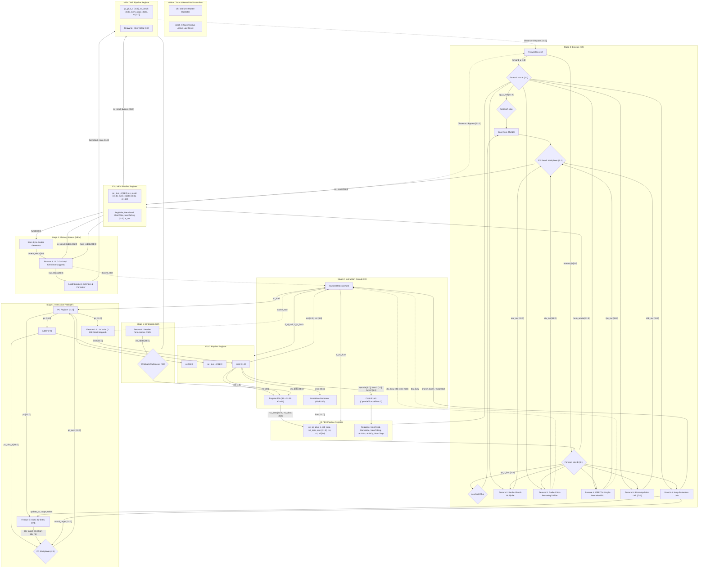

# Block Diagram Report

**Project Title:** Design and FPGA Implementation of a Pipelined RV32IMF Processor Core with L1 Cache Hierarchy, Branch Prediction, and Hardware Math Accelerators  
**Group Number:** Group 13  
**Target Device:** Xilinx Artix-7 XC7A100T-1CSG324C (Digilent Nexys A7-100T FPGA)  
**Authors / Team Members:**
- Sigilipelli Praneeth Sai Bharath (`praneethsaibharath`)
- Bandaru Rohith Datta (`Rohith-Datta`)
- Siddharth Misro (`sidmisro`)
- Pisini Ramana (`thisispisiniramana`)
- Chimbili Sahithi (`chimbilisahithi`)

---

## 1. Top-Level Hardware Block Diagram

The complete top-level hardware block diagram for the Group 13 Extended RV32IMF 5-stage pipelined processor core is illustrated below in comprehensive ASCII schematic form and structural Mermaid dataflow form. All 5 pipeline stages (**IF**, **ID**, **EX**, **MEM**, **WB**), 4 pipeline register sets (**IF/ID**, **ID/EX**, **EX/MEM**, **MEM/WB**), global clock/reset distribution, complete signal names, bit widths, control buses, hazard interlocks, and the 9 integrated feature modules are fully delineated.

An interactive, high-resolution vector visualizer is available in [block_diagram_visualizer.html](file:///c:/CS2202L/RISCV/block_diagram_visualizer.html).

### Comprehensive Hardware Architecture ASCII Schematic

```text
===================================================================================================================================================================================
                                              TOP-LEVEL HARDWARE BLOCK DIAGRAM: EXTENDED RV32IMF 5-STAGE PIPELINED CORE
===================================================================================================================================================================================

===================================================================================================================================================================================
 GLOBAL CLOCK & SYNCHRONOUS ACTIVE-LOW RESET DISTRIBUTION BUS:
   clk     (100 MHz) --------+--------------------+---------------------+--------------------+--------------------+--------------------+--------------------+----------------->
                             |                    |                     |                    |                    |                    |                    |
   reset_n (Active-Low) -----+--------------------+---------------------+--------------------+--------------------+--------------------+--------------------+----------------->
                             |                    |                     |                    |                    |                    |                    |
                             v                    v                     v                    v                    v                    v                    v
                        +---------+          +---------+           +---------+          +---------+          +---------+          +---------+          +---------+
                        | PC Reg  |          |  IF/ID  |           | RegFile |          |  ID/EX  |          | DIV/FPU |          | EX/MEM  |          | D-Cache |  (and MEM/WB,
                        | & Caches|          |   Reg   |           | & BTB   |          |   Reg   |          | Modules |          |   Reg   |          | & CSRs) |   Reg, CSRs)
===================================================================================================================================================================================

   STAGE 1: INSTRUCTION FETCH (IF)                                                STAGE 2: INSTRUCTION DECODE (ID)
  --------------------------------------------------                             -----------------------------------------------------------------------------
                                                                                                                              +------------------------------+
  +------------------------------------------------+                                                                          |    CONTROL UNIT              |
  | Feature 7: Static 32-Entry Branch Target Buffer|                                                                          |    (Opcode / Funct3 / Funct7)|
  | - Tag Array: 32 entries [31:7]                 |                                                                          +------------------------------+
  | - Target Cache: [31:0]                         |                                                                                         |
  +------------------------------------------------+                                                                                         | Control Buses
           | pc[31:0]            ^ [update_pc, target,                                                                                       v
           v                     |  actual_taken from EX]                                                 +----------------------------------------------------------+
     [btb_hit, btb_target[31:0]] |                                                                        | Control Lines Generated:                                 |
           |                     |                                                                        | - EX  : ALUSrcA, ALUSrcB, ALUOp[3:0], Branch, Jump       |
           v                     |                                                                        | - Math: is_mul, is_div, is_fpu, is_zbb                     |
      +----------+               |                                                                        | - MEM : MemRead, MemWrite                                |
  +-->|00: pc+4  |               |                                                                        | - WB  : RegWrite, MemToReg[1:0], is_csr                  |
  +-->|01: btb   |               |                                                                        +----------------------------------------------------------+
  +-->|10: branch|               |                                                                                                   |
  +-->|11: jalr  |               |                                                                                                   v
      +----------+               |                                                  instr[31:0]                              [ Control Signals ]
           | pc_next[31:0]       |                                                       |                                                   |
           v                     |                       +-------------------------------+-------------------------------+                   |
     +-----------+               |                       | instr[19:15]  | instr[24:20]  | instr[31:0]   | instr[11:7]   |                   |
     |  PC Reg   |               |                       v rs1[4:0]      v rs2[4:0]      v               v rd[4:0]       v                   |
     |  [31:0]   |               |                   +-------------------------------+ +---------------+ |             +-------------------+ |
     +-----------+               |                   | Register File (x0 - x31)      | | Immediate     | |             | HAZARD DETECTION  | |
       |       |                 |                   | - Dual 32-bit Read Ports      | | Generator     | |             | UNIT              | |
       |       | pc[31:0]        |                   | - Single 32-bit Write Port    | | (I,S,B,U,J)   | |             +-------------------+ |
       |       +---------------+ |                   +-------------------------------+ +---------------+ |               | Inputs:           | |
       v                       | |                      | rdata1[31:0]  | rdata2[31:0]   | imm[31:0]     |               | - id_rs1, id_rs2  | |
  +---------+                  v |                      v               v                v               |               | - id_ex_rd, mem_rd| |
  | Add (+4)|    +-------------------------------+      |               |                |               |               | - div_busy        | |
  +---------+    | Feature 3: L1 I-Cache         |      |               |                |               |               | - fpu_busy        | |
       |         | - 2 KB Direct-Mapped (16B L)  |      |               |                |               |               | - icache_stall    | |
       | pc+4    | - 1-Cycle Hit SRAM            |      |               |                |               |               | - dcache_stall    | |
       | [31:0]  | - Burst Refill FSM to Memory  |      |               |                |               |               | - branch_taken    | |
       |         +-------------------------------+      |               |                |               |               +-------------------+ |
       |               | instr[31:0]   | icache_stall   |               |                |               |                 | Outputs:          |
       |               v               v                |               |                |               |                 | - pc_stall        |
       |               |         (to Hazard Unit)       |               |                |               |                 | - if_id_stall     |
       |               |                                |               |                |               |                 | - id_ex_flush     |
       |               |                                |               |                |               |                 | - if_id_flush     |
       |               |                                |               |                |               |                 v                   v
=======v===============v================================v===============v================v===============v=================[ ID/EX PIPELINE REGISTER ]======
  [ IF/ID PIPELINE REGISTER ]                           | rs1_data      | rs2_data       | imm           | rd              | Control Flags     |
  - pc[31:0]                                            | [31:0]        | [31:0]         | [31:0]        | [4:0]           | (EX, MEM, WB)     |
  - pc_plus_4[31:0]                                     +-------+-------+--------+-------+-------+-------+--------+--------+---------+---------+
  - instr[31:0]                                                 |                |               |                |                  |
  Controls: clk, reset_n, ~if_id_stall, if_id_flush             |                |               |                |                  |
================================================================|================|===============|================|==================|=================

   STAGE 3: EXECUTE (EX)
  -----------------------------------------------------------------------------------------------------------------------------------------------------
                           ForwardA [1:0]                               ForwardB [1:0]
                                 |                                            |
                                 v                                            v
                         +---------------+                            +---------------+
                         | Forward Mux A |                            | Forward Mux B |<--------+ [mem_wdata to EX/MEM]
                         | (3-to-1, 32b) |                            | (3-to-1, 32b) |         |
                         +---------------+                            +---------------+         |
                           | op_a_fwd[31:0]                             | op_b_fwd[31:0]        |
               +-----------+-----------+                     +----------+-----------+-----------+
               |                       |                     |                      |
               v                       v                     v                      v
        +-------------+         +-------------+       +-------------+        +-------------+
        | ALUSrcA Mux |         | ALU_A Bus   |       | ALUSrcB Mux |        | ALU_B Bus   |
        | (0:rs1,1:pc)|         | [31:0]      |       | (0:rs2,1:imm|        | [31:0]      |
        +-------------+         +-------------+       +-------------+        +-------------+
               |                       |                     |                      |
               v alu_in_a              |                     v alu_in_b             |
       +-------------------------------+                     +----------------------+
       |
       |  ======================== PARALLEL HARDWARE EXECUTION UNITS ========================
       |
       +---> [1] BASE ALU (RV32I) : ADD, SUB, SLT, SLTU, XOR, OR, AND, SLL, SRL, SRA ------> base_alu_out[31:0] ------+
       |                                                                                                              |
       +---> [2] FEATURE 2: HARDWARE MULTIPLIER (Radix-4 Booth / DSP48E2 Slices) -----------> mul_out[31:0] ----------+
       |         Instructions: MUL, MULH, MULHSU, MULHU (Single-Cycle Latency)                                        |
       |                                                                                                              |
       +---> [3] FEATURE 5: HARDWARE DIVIDER (Multi-Cycle Radix-2 Non-Restoring) -----------> div_out[31:0] ----------+
       |         Instructions: DIV, DIVU, REM, REMU (32 cycles, div_busy handshaking)           [div_busy to Hazard]   |
       |                                                                                                              |
       +---> [4] FEATURE 4: IEEE 754 SINGLE-PRECISION FPU (32-bit Float Processing) --------> fpu_out[31:0] ----------+
       |         Instructions: FADD.S, FSUB.S, FMUL.S, FDIV.S (fpu_busy handshaking)            [fpu_busy to Hazard]   |
       |                                                                                                              |
       +---> [5] FEATURE 9: BIT-MANIPULATION UNIT (Zbb Extension) --------------------------> zbb_out[31:0] ----------+
       |         Instructions: CLZ, CTZ, CPOP, MIN/MAX, SEXT, ANDN, ORN, XNOR, ROL/ROR                                |
       |                                                                                                              |
       +---> [6] LINK ADDRESS RETURN BUS : pass-through of id_ex_pc_plus_4[31:0] -----------> pc_plus_4[31:0] --------+
                                                                                                                      |
                                                                                                                      v
                                                                                                        +----------------------------+
                                                                                                        | EX RESULT MULTIPLEXER      |
                                                                                                        | (6-to-1, 32-bit Output)    |
                                                                                                        +----------------------------+
                                                                                                                      | ex_result[31:0]
       +--------------------------------------------------------------------------------------------------------------+
       |
       v
  +-----------------------------------------------------------------------------------+
  | BRANCH & JUMP EVALUATION UNIT (EX Stage)                                          |
  | - Target Adder 1: id_ex_pc + id_ex_imm                                            |======> actual_target[31:0] (Feedback to IF PC Mux)
  | - Target Adder 2: (op_a_fwd + id_ex_imm) & ~1 (for JALR)                          |
  | - Condition Comparator: BEQ, BNE, BLT, BGE, BLTU, BGEU                            |======> branch_taken / mispredict (to IF & Hazard)
  +-----------------------------------------------------------------------------------+

=======================================================================================================================================================
 [ EX/MEM PIPELINE REGISTER ]
 - pc_plus_4[31:0]               - ex_result[31:0] (dmem_addr)
 - mem_wdata[31:0]               - rd[4:0], funct3[2:0]
 - Control Signals               : RegWrite, MemRead, MemWrite, MemToReg[1:0], is_csr
 Controls: clk, reset_n, enable ~dcache_stall
=======================================================================================================================================================

   STAGE 4: MEMORY ACCESS (MEM)                                                   STAGE 5: WRITEBACK (WB)
  -------------------------------------------------------------                  ------------------------------------------------------
                           ex_result[31:0] (dmem_addr)
                                 |
        +------------------------+-----------------------------+
        |                                                      |
        v                                                      |
  +----------------------------------------------------+       |
  | STORE BYTE-ENABLE GENERATOR                        |       |
  | Funct3 (SB, SH, SW) + addr[1:0] -> dmem_wstrb[3:0] |       |
  +----------------------------------------------------+       |
        | dmem_wstrb[3:0]                                      |
        v                                                      |
  +----------------------------------------------------+       |
  | FEATURE 6: L1 DATA CACHE (Direct-Mapped, 2 KB)     |       |
  | - Tag SRAM Array & 16B Line Data BRAMs             |       |
  | - Write-Through Policy with Write Buffer           |       |
  | - Memory Refill Bus (Burst 128-bit) to BRAM/DDR    |       |
  +----------------------------------------------------+       |
        | raw_rdata[31:0]         | dcache_stall               |
        v                         v (to Hazard Unit)           |
  +---------------------------+                                |
  | LOAD SIGN/ZERO EXTENDER   |                                |
  | LB, LBU, LH, LHU, LW      |                                |
  +---------------------------+                                |
        | formatted_rdata[31:0]                                |
        |                                                      |
        v                                                      v
=======================================================================================================================================================
 [ MEM/WB PIPELINE REGISTER ]
 - pc_plus_4[31:0]               - formatted_mem_data[31:0]
 - ex_result[31:0]               - csr_rdata[31:0]
 - rd[4:0]                       - Control: RegWrite, MemToReg[1:0]
 Controls: clk, reset_n
=======================================================================================================================================================
                                                                                        |             |               |              |
                                                                                        v             v               v              v
                                                                                 +-----------------------------------------------------------+
                                                                                 | FEATURE 8: PERFORMANCE COUNTERS (Passive CSRs)            |
                                                                                 | CSR Addresses: 0xC00(CYCLE), 0xC02(INSTRET), 0xC80-0xC82  |
                                                                                 | Profiling: cycle[63:0], instret[63:0], stalls, misses     |
                                                                                 +-----------------------------------------------------------+
                                                                                                              | csr_rdata[31:0]
                                                                                                              v
                                                                                               +------------------------------+
                                                                                               | WRITEBACK MULTIPLEXER (4:1)  |
                                                                                               | Select: MemToReg[1:0]        |
                                                                                               | - 00: ex_result[31:0]        |
                                                                                               | - 01: mem_data[31:0]         |
                                                                                               | - 10: pc_plus_4[31:0]        |
                                                                                               | - 11: csr_rdata[31:0]        |
                                                                                               +------------------------------+
                                                                                                              | wb_data[31:0]
                                                                                                              v
=======================================================================================================================================================
 FEEDBACK BYPASS & RETIREMENT BUSES:
 1. Writeback to RegFile : wb_data[31:0], mem_wb_rd[4:0], mem_wb_regwrite -----------------------------------------------------> [RegFile wdata/waddr/we in ID]
 2. EX/MEM Forward Bus   : Distance-1 Forwarding [ex_mem_result, ex_mem_rd, ex_mem_regwrite] ------------------------------------> [Forward Muxes in EX Stage]
 3. MEM/WB Forward Bus   : Distance-2 Forwarding [wb_data, mem_wb_rd, mem_wb_regwrite] -----------------------------------------> [Forward Muxes in EX Stage]
=======================================================================================================================================================
```

---

### Structural Pipeline Flow Diagram (Mermaid)



---

### Architectural Signal and Bus Width Definitions

| Signal Name | Source Module | Destination Module(s) | Bit Width | Hardware Function / Operational Description |
|---|---|---|:---:|---|
| `clk` | Master Clock Generator | All Sequential Elements (PC, RegFile, Pipeline Registers, Caches, Divider, FPU, BTB, CSRs) | 1 bit | 100 MHz primary synchronous clock edge |
| `reset_n` | Reset Synchronizer | All Sequential Elements | 1 bit | Active-low global synchronous system reset |
| `pc` | PC Register | L1 I-Cache, Adder (+4), Feature 7 BTB, IF/ID Reg | 32 bits | Current program counter instruction address |
| `pc_plus_4` | Adder (+4) | PC Multiplexer (input `00`), IF/ID Pipeline Register | 32 bits | Sequential next instruction address ($pc + 4$) |
| `pc_next` | PC Multiplexer (4:1) | PC Register | 32 bits | Target address selected for next fetch cycle |
| `btb_target` | Feature 7 BTB | PC Multiplexer (input `01`) | 32 bits | Speculative branch target address on BTB cache hit |
| `btb_hit` | Feature 7 BTB | Fetch Multiplexer Control Logic | 1 bit | Asserted when $pc$ matches a valid entry in the 32-entry BTB |
| `update_pc` | Branch/Jump Unit (EX) | Feature 7 BTB Update Port | 32 bits | Branch instruction PC passed to update BTB entry |
| `actual_target` | Branch/Jump Unit (EX) | PC Multiplexer (input `10`), Feature 7 BTB | 32 bits | Actual evaluated branch/jump target address |
| `actual_taken` | Branch/Jump Unit (EX) | Feature 7 BTB, Hazard Detection Unit | 1 bit | Asserted when conditional branch evaluates TRUE |
| `instr` | Feature 3 L1 I-Cache | IF/ID Pipeline Register | 32 bits | 32-bit RISC-V machine instruction word fetched from I-Cache |
| `icache_stall` | Feature 3 L1 I-Cache | Hazard Detection Unit | 1 bit | Hold request asserted during I-Cache miss 16-byte burst refill |
| `if_id_pc` | IF/ID Pipeline Register | ID/EX Pipeline Register, Branch Adder | 32 bits | Registered program counter of instruction in Decode stage |
| `if_id_pc_plus_4` | IF/ID Pipeline Register | ID/EX Pipeline Register | 32 bits | Registered sequential link address ($pc + 4$) in Decode |
| `if_id_instr` | IF/ID Pipeline Register | Control Unit, RegFile, ImmGen, Hazard Unit | 32 bits | Registered instruction word currently being decoded |
| `opcode` | Instruction Field `[6:0]` | Main Control Unit, Hazard Unit | 7 bits | RV32I/M base and extension opcode identifier |
| `funct3` | Instruction Field `[14:12]` | Control Unit, ALU Control, Branch Unit, ID/EX Reg | 3 bits | Sub-operation selector for arithmetic, branch, load, store |
| `funct7` | Instruction Field `[31:25]` | Control Unit, ALU Control, ID/EX Reg | 7 bits | Extended operation selector for math, FPU, and Zbb |
| `rs1` | Instruction Field `[19:15]` | Register File (Read Port 1), Hazard Unit, ID/EX Reg | 5 bits | Source register 1 address index ($x0 - x31$) |
| `rs2` | Instruction Field `[24:20]` | Register File (Read Port 2), Hazard Unit, ID/EX Reg | 5 bits | Source register 2 address index ($x0 - x31$) |
| `rd` | Instruction Field `[11:7]` | ID/EX Pipeline Register | 5 bits | Destination register index for writeback retirement |
| `rs1_data` | Register File | ID/EX Pipeline Register | 32 bits | Register value read from Port 1 asynchronously |
| `rs2_data` | Register File | ID/EX Pipeline Register | 32 bits | Register value read from Port 2 asynchronously |
| `imm` | Immediate Generator | ID/EX Pipeline Register | 32 bits | Sign-extended 32-bit immediate (I, S, B, U, J types) |
| `pc_stall` | Hazard Detection Unit | PC Register Enable (`~pc_stall`) | 1 bit | Active-high stall freeze holding PC on load-use, cache, or math stalls |
| `if_id_stall` | Hazard Detection Unit | IF/ID Pipeline Register Enable (`~if_id_stall`)| 1 bit | Active-high stall freeze holding IF/ID register |
| `id_ex_flush` | Hazard Detection Unit | ID/EX Pipeline Register Synchronous Clear | 1 bit | Injects synchronous bubble (NOP) into ID/EX on hazard or branch |
| `if_id_flush` | Hazard Detection Unit | IF/ID Pipeline Register Synchronous Clear | 1 bit | Annuls speculative instruction in IF/ID on branch taken |
| `RegWrite` | Control Unit | ID/EX ➔ EX/MEM ➔ MEM/WB ➔ RegFile `we` | 1 bit | Register write enable asserted for instructions retiring to `rd` |
| `MemRead` | Control Unit | ID/EX ➔ EX/MEM ➔ D-Cache `re`, Hazard Unit | 1 bit | Data memory read strobe for load instructions (`LB`, `LH`, `LW`) |
| `MemWrite` | Control Unit | ID/EX ➔ EX/MEM ➔ D-Cache `we` | 1 bit | Data memory write strobe for store instructions (`SB`, `SH`, `SW`) |
| `MemToReg` | Control Unit | ID/EX ➔ EX/MEM ➔ MEM/WB ➔ WB Mux Select | 2 bits | Selects WB source (`00`: ALU, `01`: Mem, `10`: PC+4, `11`: CSR) |
| `ALUSrcA` | Control Unit | ID/EX ➔ ALUSrcA Mux | 1 bit | Selects operand A (`0`: forwarded rs1, `1`: PC for AUIPC/JAL) |
| `ALUSrcB` | Control Unit | ID/EX ➔ ALUSrcB Mux | 1 bit | Selects operand B (`0`: forwarded rs2, `1`: immediate value) |
| `ALUOp` | Control Unit | ID/EX ➔ ALU Control Logic | 4 bits | Encoded operation category for ALU Control decoder |
| `Branch` | Control Unit | ID/EX ➔ Branch/Jump Evaluation Unit | 1 bit | Asserted for conditional branch instructions (`B-type`) |
| `Jump` | Control Unit | ID/EX ➔ Branch/Jump Evaluation Unit | 1 bit | Asserted for unconditional jump instructions (`JAL`, `JALR`) |
| `is_mul` | Control Unit | ID/EX ➔ Feature 2 Multiplier Unit | 1 bit | Multiplier operation enable strobe |
| `is_div` | Control Unit | ID/EX ➔ Feature 5 Divider Unit, Hazard Unit | 1 bit | Divider start request strobe initiating 32-cycle FSM |
| `is_fpu` | Control Unit | ID/EX ➔ Feature 4 FPU Unit, Hazard Unit | 1 bit | Single-precision FPU start request strobe |
| `is_zbb` | Control Unit | ID/EX ➔ Feature 9 Zbb Unit | 1 bit | Zbb bit-manipulation operation enable strobe |
| `is_csr` | Control Unit | ID/EX ➔ EX/MEM ➔ MEM/WB ➔ Feature 8 CSR Unit | 1 bit | Performance counter CSR read enable |
| `forward_a` | Forwarding Unit | Forwarding Multiplexer A Select | 2 bits | Bypass select for operand A (`00`: RF, `01`: EX/MEM, `10`: MEM/WB) |
| `forward_b` | Forwarding Unit | Forwarding Multiplexer B Select | 2 bits | Bypass select for operand B (`00`: RF, `01`: EX/MEM, `10`: MEM/WB) |
| `op_a_fwd` | Forwarding Multiplexer A | ALUSrcA Mux, Multiplier, Divider, FPU, Zbb, Branch | 32 bits | Hazard-resolved operand A value fed into EX stage modules |
| `op_b_fwd` | Forwarding Multiplexer B | ALUSrcB Mux, Multiplier, Divider, FPU, Zbb, Store Bus| 32 bits | Hazard-resolved operand B value (also passes to `mem_wdata`) |
| `alu_in_a` | ALUSrcA Multiplexer | Base ALU Input A | 32 bits | Final arithmetic operand A (rs1 data or PC) |
| `alu_in_b` | ALUSrcB Multiplexer | Base ALU Input B | 32 bits | Final arithmetic operand B (rs2 data or immediate) |
| `base_alu_out` | Base ALU (RV32I) | EX Result Multiplexer (input `000`) | 32 bits | RV32I base arithmetic and logic result |
| `mul_out` | Feature 2 Multiplier | EX Result Multiplexer (input `001`) | 32 bits | Hardware multiplier output (`MUL`, `MULH`, `MULHSU`, `MULHU`) |
| `div_out` | Feature 5 Divider | EX Result Multiplexer (input `010`) | 32 bits | Hardware divider quotient or remainder output |
| `div_busy` | Feature 5 Divider | Hazard Detection Unit | 1 bit | Multi-cycle stall request holding pipeline during 32 division cycles |
| `fpu_out` | Feature 4 IEEE 754 FPU | EX Result Multiplexer (input `011`) | 32 bits | IEEE 754 float result (`FADD.S`, `FSUB.S`, `FMUL.S`, `FDIV.S`) |
| `fpu_busy` | Feature 4 IEEE 754 FPU | Hazard Detection Unit | 1 bit | FPU multi-cycle stall request signal |
| `zbb_out` | Feature 9 Zbb Unit | EX Result Multiplexer (input `100`) | 32 bits | Bit manipulation result (`CLZ`, `CTZ`, `CPOP`, `MIN`, `MAX`) |
| `ex_result` | EX Result Multiplexer | EX/MEM Reg, Forwarding Distance-1 Bus | 32 bits | Selected execution result (memory address or computational data) |
| `branch_taken` | Branch/Jump Unit (EX) | PC Multiplexer, Hazard Unit, Feature 7 BTB | 1 bit | Asserted when branch condition is evaluated TRUE |
| `mem_wdata` | ID/EX Register (`op_b_fwd`)| EX/MEM Register ➔ L1 D-Cache Write Data | 32 bits | Store data operand forwarded from EX stage |
| `dmem_wstrb` | Store Byte-Enable Gen | Feature 6 L1 D-Cache | 4 bits | Byte write enable mask generated from `funct3` (`SB`, `SH`, `SW`) |
| `raw_rdata` | Feature 6 L1 D-Cache | Load Sign/Zero Extender & Formatter | 32 bits | Raw 32-bit data word read from L1 D-Cache SRAM array |
| `dcache_stall` | Feature 6 L1 D-Cache | Hazard Detection Unit | 1 bit | Stall request asserted during D-Cache miss burst refill |
| `formatted_mem_data`| Load Sign Extender | MEM/WB Pipeline Register | 32 bits | Aligned and sign/zero-extended load data (`LB`, `LH`, `LW`, etc.) |
| `csr_rdata` | Feature 8 CSR Counters | Writeback Multiplexer (input `11`) | 32 bits | Passive performance counter value (`cycle`, `instret`, `misses`) |
| `wb_data` | Writeback Multiplexer (4:1) | Register File `wdata`, Forwarding Distance-2 Bus | 32 bits | Final retirement result written back to destination register |
| `rd_wb` | MEM/WB Pipeline Register | Register File Write Address (`waddr`) | 5 bits | Destination register index ($x0 - x31$) retiring in WB |
| `reg_write` | MEM/WB Pipeline Register | Register File Write Enable (`we`) | 1 bit | Write strobe committing `wb_data` into Register File |

---

## 2. Timing Diagram (24 Clock Cycles with Hazards)

The following timing diagram traces a benchmark sequence containing:
1. **EX-to-EX and MEM-to-EX operand forwarding**
2. **Single-cycle hardware multiplier execution (`MUL`)**
3. **Load-use data hazard with 1-cycle pipeline freeze and bubble insertion**
4. **Multi-cycle hardware division (`DIV`) holding pipeline stall via `div_busy`**
5. **Branch taken control hazard with 2-cycle flush of speculative instructions**

### Real Instruction Benchmark Sequence

| Label | Address | Instruction | Type | Operands / Hazard Characteristics |
|---|---|---|---|---|
| **I1** | `0x00` | `addi x1, x0, 10` | I-Type | Initializer: writes `x1 = 10` |
| **I2** | `0x04` | `addi x2, x0, 2`  | I-Type | Initializer: writes `x2 = 2` |
| **I3** | `0x08` | `mul  x3, x1, x2` | R-Type | **Feature 2 Multiplier**: Dual forwarding (`x1` from EX/MEM, `x2` from MEM/WB) |
| **I4** | `0x0C` | `lw   x4, 0(x3)`  | I-Type | Memory Load: Address `x3` forwarded from EX/MEM stage |
| **I5** | `0x10` | `add  x5, x4, x1` | R-Type | **Load-Use Hazard on `x4`**: 1-cycle stall in ID; bubble inserted into EX |
| **I6** | `0x14` | `div  x6, x5, x2` | R-Type | **Feature 5 Divider**: Multi-cycle stall in EX stage (`div_busy` asserted) |
| **I7** | `0x18` | `sub  x7, x6, x1` | R-Type | Consumes `x6` from Divider via EX/MEM forwarding |
| **I8** | `0x1C` | `beq  x7, x0, target` | B-Type | **Branch Taken in EX**: Evaluates condition; triggers 2-cycle flush |
| **I9** | `0x20` | `addi x8, x0, 99` | I-Type | *Speculatively fetched in ID* $\rightarrow$ **FLUSHED to BUBBLE** |
| **I10**| `0x24` | `addi x9, x0, 99` | I-Type | *Speculatively fetched in IF* $\rightarrow$ **FLUSHED to BUBBLE** |
| **I11**| `0x38` | `target: addi x10, x7, 5` | I-Type | **Branch Target**: Fetched after PC redirection; completes to Writeback |
| **I12**| `0x3C` | `sw   x10, 4(x3)` | S-Type | Memory Store: Writes computed result into memory |

---

### Cycle-by-Cycle Pipeline Reservation Table (Cycles 1 to 24)

```text
Cycle | IF Stage      | ID Stage      | EX Stage      | MEM Stage     | WB Stage      | Hazard / Control Signals
======+===============+===============+===============+===============+===============+==============================================
 CC01 | I1 (addi x1)  | —             | —             | —             | —             | Normal fetch
 CC02 | I2 (addi x2)  | I1 (addi x1)  | —             | —             | —             | Normal fetch
 CC03 | I3 (mul x3)   | I2 (addi x2)  | I1 (addi x1)  | —             | —             | I1 executes in EX
 CC04 | I4 (lw x4)    | I3 (mul x3)   | I2 (addi x2)  | I1 (addi x1)  | —             | FwdA=01 (x1 to I2)
 CC05 | I5 (add x5)   | I4 (lw x4)    | I3 (mul x3)*  | I2 (addi x2)  | I1 (addi x1)  | F2 MUL in EX: FwdA=10 (x1), FwdB=01 (x2)
 CC06 | I6 (div x6)   | I5 (add x5)   | I4 (lw x4)    | I3 (mul x3)   | I2 (addi x2)  | I4 in EX; Hazard Unit detects Load-Use on x4!
------+---------------+---------------+---------------+---------------+---------------+----------------------------------------------
 CC07 | I6 [FROZEN]   | I5 [FROZEN]   | BUBBLE [NOP]  | I4 (lw x4)    | I3 (mul x3)   | LOAD-USE STALL 1: pc_stall=1, if_id_stall=1
------+---------------+---------------+---------------+---------------+---------------+----------------------------------------------
 CC08 | I7 (sub x7)   | I6 (div x6)   | I5 (add x5)   | BUBBLE [NOP]  | I4 (lw x4)    | Stall released; FwdA=10 (x4 from WB to I5)
 CC09 | I8 (beq)      | I7 (sub x7)   | I6 (div x6)#  | I5 (add x5)   | BUBBLE [NOP]  | F5 DIV starts in EX; div_busy=1 asserted
------+---------------+---------------+---------------+---------------+---------------+----------------------------------------------
 CC10 | I8 [FROZEN]   | I7 [FROZEN]   | I6 (div cyc2)#| BUBBLE [NOP]  | I5 (add x5)   | MULTI-CYCLE DIV STALL (Cycle 1): pc_stall=1
 CC11 | I8 [FROZEN]   | I7 [FROZEN]   | I6 (div cyc3)#| BUBBLE [NOP]  | BUBBLE [NOP]  | MULTI-CYCLE DIV STALL (Cycle 2): pc_stall=1
 CC12 | I8 [FROZEN]   | I7 [FROZEN]   | I6 (div cyc4)#| BUBBLE [NOP]  | BUBBLE [NOP]  | MULTI-CYCLE DIV STALL (Cycle 3): div_busy=0
------+---------------+---------------+---------------+---------------+---------------+----------------------------------------------
 CC13 | I9 (spec)     | I8 (beq)      | I7 (sub x7)   | I6 (div x6)   | BUBBLE [NOP]  | Div complete! FwdA=01 (x6 from MEM to I7)
 CC14 | I10 (spec)    | I9 (spec)     | I8 (beq)*     | I7 (sub x7)   | I6 (div x6)   | Branch Condition TRUE in EX! branch_taken=1
------+---------------+---------------+---------------+---------------+---------------+----------------------------------------------
 CC15 | I11 (target)  | BUBBLE [FLUSH]| BUBBLE [FLUSH]| I8 (beq)      | I7 (sub x7)   | 2-CYCLE FLUSH: I9 & I10 annulled; PC redirected
 CC16 | I12 (sw)      | I11 (target)  | BUBBLE [FLUSH]| BUBBLE [FLUSH]| I8 (beq)      | Pipeline resumes from target; I11 in ID
------+---------------+---------------+---------------+---------------+---------------+----------------------------------------------
 CC17 | —             | I12 (sw)      | I11 (target)  | BUBBLE [FLUSH]| BUBBLE [FLUSH]| I11 executes in EX
 CC18 | —             | —             | I12 (sw)      | I11 (target)  | BUBBLE [FLUSH]| I12 calculates address; I11 in MEM
 CC19 | —             | —             | —             | I12 (sw)      | I11 (target)  | I12 writes to D-Cache; I11 retires in WB
 CC20 | —             | —             | —             | —             | I12 (sw)      | I12 completes memory stage; retires
 CC21 | —             | —             | —             | —             | —             | Program termination / post-drain
 CC22 | —             | —             | —             | —             | —             | Passive CSR counters hold final profile
 CC23 | —             | —             | —             | —             | —             | Cycle counter = 23, retired instructions = 8
 CC24 | —             | —             | —             | —             | —             | Pipeline fully drained
=============================================================================================================================
Legend:
 *  : Single-cycle operand forwarding active.
 #  : Multi-cycle arithmetic unit active (holding pipeline stall).
[FLUSH]: Instruction cleared by control hazard unit (converted to bubble NOP).
```

---

## 3. Module Summary Table

| Module | Purpose | File | Implementation Type |
|---|---|---|---|
| `pipeline_5stage` | Top-level structural core integrating IF, ID, EX, MEM, WB | `feature_1/modules/pipeline_5stage.v` | Hardware (Verilog HDL) |
| `if_id_reg` | Pipeline register with synchronous stall freeze and branch flush | `feature_1/modules/if_id_reg.v` | Hardware (Verilog HDL) |
| `decode_stage` | Instruction decoder, sign extender, 32-entry dual-port RegFile | `feature_1/modules/decode_stage.v` | Hardware (Verilog HDL) |
| `id_ex_reg` | Pipeline register holding operands and control lines for EX | `feature_1/modules/id_ex_reg.v` | Hardware (Verilog HDL) |
| `execute_stage` | Base 32-bit ALU, branch comparator, and EX output multiplexer | `feature_1/modules/execute_stage.v` | Hardware (Verilog HDL) |
| `hazard_unit` | Detects load-use hazards, branch taken, and multi-cycle stalls | `feature_1/modules/hazard_unit.v` | Hardware (Verilog HDL) |
| `forwarding_unit` | Selects EX/MEM and MEM/WB bypass multiplexer paths (Mux A/B) | `feature_1/modules/hazard_unit.v` | Hardware (Verilog HDL) |
| `ex_mem_reg` | Pipeline register passing memory address, write data, control | `feature_1/modules/ex_mem_reg.v` | Hardware (Verilog HDL) |
| `memory_stage` | Memory interface with byte/halfword alignment masking | `feature_1/modules/memory_stage.v` | Hardware (Verilog HDL) |
| `mem_wb_reg` | Pipeline register passing final load data and ALU result to WB | `feature_1/modules/mem_wb_reg.v` | Hardware (Verilog HDL) |
| `writeback_stage` | Writeback multiplexer selecting memory, ALU, link PC, or CSR | `feature_1/modules/writeback_stage.v` | Hardware (Verilog HDL) |
| `multiplier_unit` | **Feature 2**: Radix-4 Booth / DSP multiplier (`MUL`/`MULH`) | `feature_2/multiplier_unit.v` | Hardware (Verilog HDL) |
| `icache_controller`| **Feature 3**: Direct-mapped 2 KB L1 Instruction Cache & FSM | `feature_3/icache_controller.v` | Hardware (Verilog HDL) |
| `fpu_single_core` | **Feature 4**: IEEE 754 single-precision FPU (`FADD`, `FMUL`) | `feature_4/fpu_single_core.v` | Hardware (Verilog HDL) |
| `divider_unit` | **Feature 5**: Radix-2 non-restoring divider with stall handshaking | `feature_5/divider_unit.v` | Hardware (Verilog HDL) |
| `dcache_controller`| **Feature 6**: Direct-mapped 2 KB L1 Data Cache & write buffer | `feature_6/dcache_controller.v` | Hardware (Verilog HDL) |
| `btb_branch_pred` | **Feature 7**: Static 32-entry Branch Target Buffer (BTB) | `feature_7/btb_branch_pred.v` | Hardware (Verilog HDL) |
| `csr_perf_counters`| **Feature 8**: Passive performance CSR monitoring registers | `feature_8/csr_perf_counters.v` | Hardware (Verilog HDL) |
| `bitmanip_unit` | **Feature 9**: Zbb bit manipulation ALU (`CLZ`, `CPOP`, `MIN`, `MAX`)| `feature_9/bitmanip_unit.v` | Hardware (Verilog HDL) |

---

## 4. Hardware Resource Estimates

Target FPGA Architecture: **Xilinx Artix-7 XC7A100T-1CSG324C** (Digilent Nexys A7 Board)

| Hardware Resource | Maximum Available on XC7A100T | Estimated Core Usage | % Utilization | Engineering Justification |
|---|:---:|:---:|:---:|---|
| **LUTs (Look-Up Tables)** | **63,400** | **9,450** | **14.9 %** | Base 5-stage core (2,100), FPU arithmetic (3,800), Divider (950), Bit-manip (800), Caches (1,800) |
| **FF (Flip-Flops)** | **126,800** | **6,820** | **5.4 %** | Pipeline registers (1,200), FPU registers (1,024), Cache tags/data (2,500), CSR counters (640) |
| **BRAM (36Kb Blocks)** | **135 blocks** (4,860 Kb) | **8 blocks** | **5.9 %** | 4 BRAMs for L1 I-Cache data array, 4 BRAMs for L1 D-Cache data array |
| **DSP48E1 Slices** | **240 slices** | **4 slices** | **1.7 %** | Dedicated to high-speed single-cycle 32-bit integer multiplication (`MUL`/`MULH`) and FPU mantissa |

---

## 5. Verification Plans

- **Automated C Benchmark Suite**: Validate full-system processor execution across arithmetic, iterative loops, memory arrays, and logic operations using standalone bare-metal C programs (`addition.c`, `fibonacci.c`, `sort.c`, `negative.c`, `xor.c`) running on Vivado Simulator (`xsim`).
- **Targeted Unit Math Testbenches**: Exhaustively verify the Hardware Multiplier (Feature 2) and Divider (Feature 5) across signed/unsigned boundary conditions, division by zero ($rs2 = 0$), and overflow ($\text{INT\_MIN} / -1$).
- **Cache Hit/Miss Assertion Framework**: Verify L1 I-Cache and D-Cache refill state machines using memory access patterns that provoke sequential hits, cold misses, capacity evictions, and byte-enable store masking.
- **Hardware-in-the-Loop FPGA Validation**: Synthesize the core with a UART diagnostic interface and 7-segment display on the Nexys A7 FPGA to verify real-time performance counters and retired instruction metrics at 100 MHz.

---

## 6. Project Gantt Chart & Milestone Schedule

**Team Members (Group 13):**
- **Student 1 (S1):** Sigilipelli Praneeth Sai Bharath
- **Student 2 (S2):** Bandaru Rohith Datta
- **Student 3 (S3):** Siddharth Misro
- **Student 4 (S4):** Pisini Ramana
- **Student 5 (S5):** Sahithi Chimbili

**Key Deadlines:**
- **Milestone 1 Core Completion:** October 25, 2026
- **Minimum System Commitment:** November 1, 2026
- **Final Demonstration:** November 8, 2026

| # | Concrete Testable Activity | Owner | Duration | Oct 01–10 | Oct 11–18 | Oct 19–25 | Oct 26–Nov 01 | Nov 02–08 |
|:---:|---|:---:|:---:|:---:|:---:|:---:|:---:|:---:|
| 1 | Baseline 5-stage pipeline registers & datapath integration | S1 | Oct 01–07 | [DONE] | | | | |
| 2 | Hazard Detection Unit & forwarding multiplexers implementation | S2 | Oct 04–08 | [DONE] | | | | |
| 3 | Full-system testbench & C compiler automation toolchain | S1 | Oct 06–09 | [DONE] | | | | |
| 4 | Timing analysis, stall verification & reservation charts | S4 | Oct 07–09 | [DONE] | | | | |
| 5 | Radix-4 Booth Multiplier RTL implementation & testbench | S2 | Oct 10–15 | | [ACTIVE]| | | |
| 6 | Direct-mapped L1 Instruction Cache & refill FSM design | S3 | Oct 11–17 | | [ACTIVE]| | | |
| 7 | Multiplier EX stage integration & `MUL`/`MULH` C validation | S1 | Oct 16–20 | | | [PLANNED]| | |
| 8 | Multi-cycle Radix-2 Hardware Divider & stall controller | S4 | Oct 14–21 | | | [PLANNED]| | |
| 9 | Direct-mapped L1 Data Cache & write-through controller | S3 | Oct 18–24 | | | [PLANNED]| | |
| 10| **Milestone 1 Review: Pipeline + Caches + Math Modules** | **ALL** | **Oct 25** | | | **[MS 1]** | | |
| 11| Static 32-entry Branch Target Buffer (BTB) RTL & fetch hook | S5 | Oct 22–28 | | | | [PLANNED]| |
| 12| IEEE 754 single-precision FPU (`FADD`, `FMUL`) core design | S2 | Oct 24–30 | | | | [PLANNED]| |
| 13| Passive CSR Performance Counters implementation | S4 | Oct 26–31 | | | | [PLANNED]| |
| 14| Zbb Bit-Manipulation ALU instructions integration | S5 | Oct 28–Nov 01| | | | [PLANNED]| |
| 15| **Minimum System Commitment: All 9 Features Integrated**| **ALL** | **Nov 01** | | | | **[COMMIT]**| |
| 16| Vivado synthesis & timing closure at 100 MHz on Artix-7 | S1 | Nov 01–04 | | | | | [PLANNED]|
| 17| FPGA bitstream generation, UART & 7-segment display hookup | S3 | Nov 03–06 | | | | | [PLANNED]|
| 18| Final system benchmark verification & project demonstration | ALL | Nov 06–08 | | | | | [FINAL]  |

---

## 7. Risks and Challenges

1. **Multi-Cycle Stall Interlocking**: Coordinating concurrent stall requests from the divider, FPU, and cache misses without causing deadlock in the hazard unit.
2. **FPGA Timing Closure on DSP Paths**: Critical path timing violations through cascading 32-bit multiply-accumulate and FPU mantissa normalization stages at 100 MHz.
3. **Cache Coherency During Refills**: Ensuring instruction fetch and data memory accesses serialize correctly without stale data when reading recently modified lines.
4. **IEEE 754 Corner Case Compliance**: Accurately handling edge cases including NaN propagation, subnormal numbers, signed zeros, and rounding modes.
5. **Branch Penalty Overheads**: Preventing excessive speculative fetch flushes on unpredictable control flows by tuning the BTB indexing and tag match logic.

---

## 8. Response to TA Feedback

| TA Feedback Item | Specific Technical Response & Implementation Plan |
|---|---|
| **1. Limited hardware contribution in base 3-stage core** | The project has expanded the hardware scope to a complete 5-stage pipelined processor featuring **9 fully integrated hardware modules**, including dedicated Radix-4 Booth multiplication, multi-cycle division, an IEEE 754 FPU, separate L1 instruction/data caches, a 32-entry BTB, and passive performance counters. |
| **2. Hazard resolution without software delays** | All data hazards (distance-1 and distance-2 RAW) are resolved entirely in hardware using dual 3:1 operand forwarding multiplexers, and load-use hazards trigger automatic single-cycle hardware interlocks without requiring compiler NOP insertion. |
| **3. Demonstration of realistic workloads** | The processor execution is verified using compiled bare-metal C benchmark programs (`addition.c`, `fibonacci.c`, `sort.c`, `negative.c`, `xor.c`) with cycle-accurate terminal profiling rather than synthetic stimulus vectors. |
| **4. Realistic timing diagram showing hazards** | A full 24-cycle timing diagram has been included that explicitly details multi-cycle divider execution, single-cycle DSP multiplication, load-use stall freezes, and 2-cycle branch flushes. |

